# Cypress

## On their own words:

>Cypress is a next generation front end testing tool built for the modern web. We address the key pain points developers and QA engineers face when testing modern applications.
>
>We make it possible to:
>
> - Set up tests
> - Write tests
> - Run tests
> - Debug Tests
>
>Cypress is most often compared to Selenium; however Cypress is both fundamentally and architecturally different. Cypress is not constrained by the same restrictions as Selenium.
>
>This enables you to write faster, easier and more reliable tests.
>Our users are typically developers or QA engineers building web applications using modern JavaScript frameworks.
>
>Cypress enables you to write all types of tests:
>
>- End-to-end tests
>- Component tests
>- Integration tests
>- Unit tests
>
>Cypress can test anything that runs in a browser.

Their documentation is fantastic, [check it out](https://docs.cypress.io/guides/overview/why-cypress).

## First Phase Reference Guide

1. If you are using WSL2, in order to access the Linux UI you will have to do some additional configuring first. The easiest way is to follow [this little guide](https://docs.cypress.io/guides/references/advanced-installation#Windows-Subsystem-for-Linux). This will be useful for other applications as well, not just Cypress (for instance, to access the graphs generated by the Python library `matplotlib`).

2. Install Cypress in **the frontend** app:

```sh
npm install --save-dev cypress
```

3. Add an npm script to the `package.json` file in **the frontend**:

```json
{
  // ...
  "scripts": {
    // other scripts
    "cypress:open": "cypress open"
  },
  // ...
}
```

Unlike the frontend's unit tests, Cypress tests can be in the frontend or the backend repository, or even in their separate repository.

The tests require that the system being tested is running. Unlike our backend integration tests, Cypress tests do not start the system when they are run.

4. Add an npm script **to the backend** to indicate the server the mode on which it will be running is test:

```json
{
  // ...
  "scripts": {
    "start": "NODE_ENV=production node index.js",
    "dev": "NODE_ENV=development nodemon index.js",
    // ... other scripts
    "start:test": "NODE_ENV=test node index.js"
  },
  // ...
}
```

5. Go to Windows and 
  - run VcXsrv via the program XLaunch:

  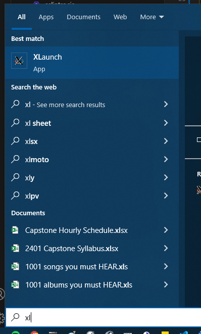

  - Check the option 'Multiple windows' or 'One large window'. Let the 'Display number' be `-1`

  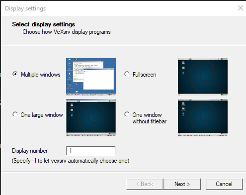

  - Check the option 'Start no client'

  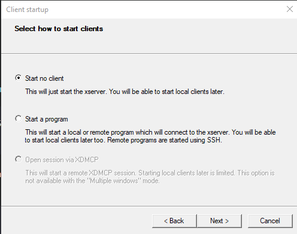

  - Check the option 'Disable access control'

  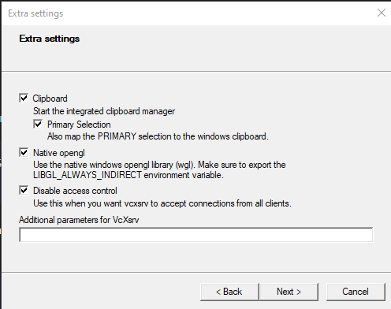


  - Click on 'Finish'

  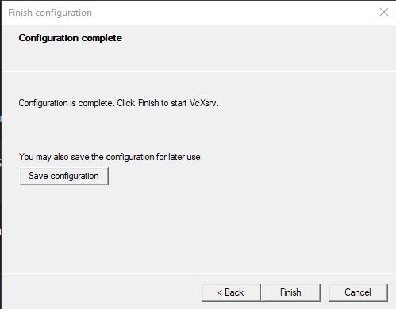

  - You won't see anything now, but notice the program is running (third icon from the left on the picture):

  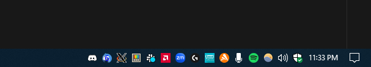

  - It will be activated when WSL2 creates a UI (like when using Cypress)


6. Go back to the application and run the backend using the `start:test` script, and the frontend. From the frontend's root folder run:

```sh
npm run cypress:open
```

A window containing the Cypress UI will appear:

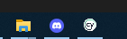

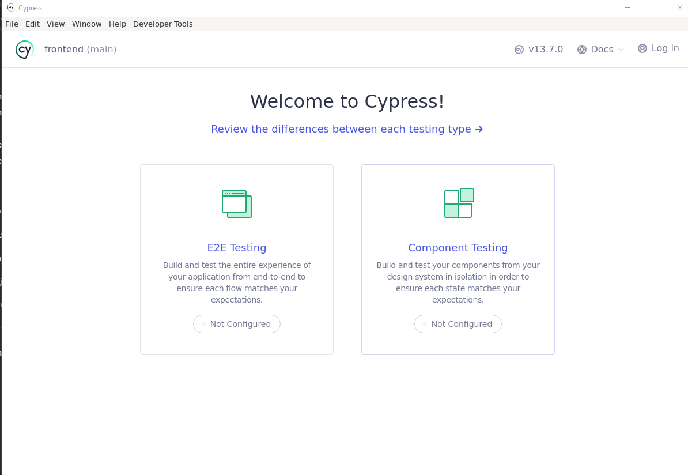

7. Click on E2E testing

8. Select a browser (like Chrome or Electron).

9. Click on Create new spec

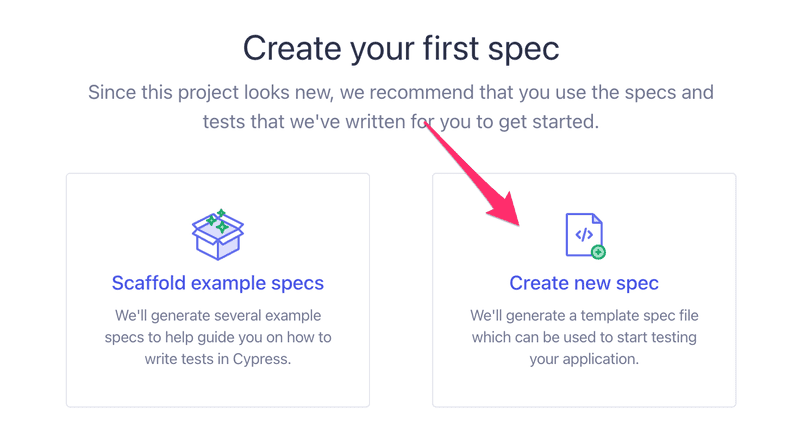

10. Create a test configuration file:

`cypress/e2e/quote_app.cy.js`

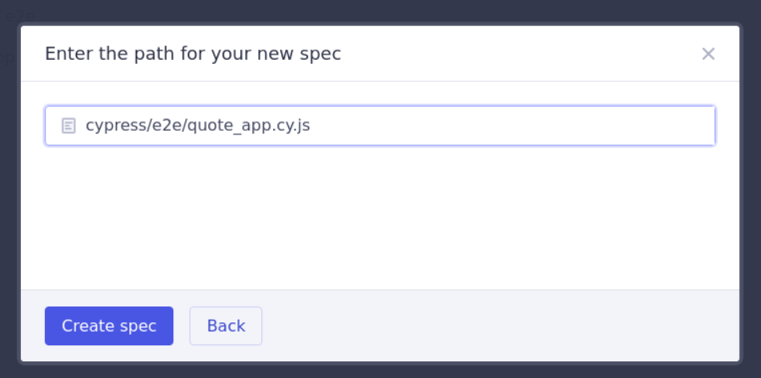

11. Let's use VS Code to edit that file. You can close the edit view in the Cypress UI:

Modify the content of the configuration file:

```js
describe('Quotelist app', function() {
  it('front page can be opened', function() {
    cy.visit('http://localhost:5174') // or whatever port the frontend is running
    cy.contains('Quotelist')
  })
})
```

12. You will see that the variable `cy` our tests use gives us a nasty Eslint error. We can get rid of it by installing `eslint-plugin-cypress` as a development dependency:

```sh
npm install --save-dev eslint-plugin-cypress
```

and changing the configuration in `.eslintrc.cjs` like this:

```js
module.exports = {
  "env": {
    browser: true,
    es2020: true,
    "jest/globals": true,
    "cypress/globals": true // !!
  },
  "extends": [ 
    // ...
  ],
  "parserOptions": {
    // ...
  },
  "plugins": [
      "react", "jest", "cypress" // !!
  ],
  "rules": {
    // ...
  }
}
```

13. Go back to the Cypress UI and run the tests. All is behaving as expected.

The structure of the test should look familiar. They use `describe` blocks to group different test cases, just like Jest. The test cases have been defined with the `it` method. Cypress borrowed these parts from the Mocha testing library that it uses under the hood.

`cy.visit` and `cy.contains` are Cypress commands, and their purpose is quite obvious:

- `cy.visit` opens the web address given to it as a parameter in the browser used by the test. 
- `cy.contains` searches for the string it received as a parameter in the page.

Note that arrow functions are not recommended: they might cause some issues in certain situations.

## Basic use

### Writing to a form

Let's extend our tests so that our new test tries to log in to our application. **We assume our backend contains a user with the username 'test' and password '1234'**.

The test begins by opening the login form.

```js
describe('Quotelist app',  function() {
  // ...

  it('login form can be opened', function() {
    cy.visit('http://localhost:5174')
    cy.contains('log in').click()
  })
})
```

The test first searches for the login button by its text and clicks the button with the command `cy.click`.

Both of our tests begin the same way, by opening the page `http://localhost:5174`, so we should extract the shared code into a `beforeEach` block run before each test:

```js
describe('Quotelist app', function() {

  beforeEach(function() {
    cy.visit('http://localhost:5174')
  })

  it('front page can be opened', function() {
    cy.contains('Quotelist')
  })

  it('login form can be opened', function() {
    cy.contains('log in').click()
  })
})
```

The login field contains two input fields, which the test should write into.

The `cy.get` command allows for searching elements by CSS selectors.

We can access the first and the last input field on the page, and write to them with the command `cy.type` like so:

```js
it('user can login', function () {
  cy.get('#login-username-input').type('test')
  cy.get('#login-password-input').type('1234')
  cy.contains('log in').click()

  cy.contains('Hello test')
})  
```

### Testing the new quote form

Add this new `describe` block within the outer `Quotelist app` block:

```js
describe('Quotelist app', function() {
  // ..
  describe('when logged in', function() {
    beforeEach(function() {
      cy.get('#login-username-input').type('test')
      cy.get('#login-password-input').type('1234')
      cy.contains('log in').click()
    
      cy.contains('Hello test')
    })

    it('a new quote can be created', function() {
      cy.get('.add-quote .quote-title').type('a quote')
      cy.get('.add-quote .quote-author').type('cypress')
      cy.contains('Add new quote').click()
      cy.contains('a quote by cypress')
      cy.contains('view').click()
      cy.contains('delete').click()
    })
  })  
})
```

The test has been defined in its own describe block. Only logged-in users can create new quotes, so we added logging in to the application to a `beforeEach` block.

Cypress runs the tests in the order they are in the code. So first it runs user can log in, where the user logs in. Then cypress will run `a new quote can be created` for which a `beforeEach` block logs in as well. Why do this? Isn't the user logged in after the first test? No, because each test starts from zero as far as the browser is concerned. All changes to the browser's state are reversed after each test.

### Controlling the state of the database

Ideally, the server's database should be the same each time we run the tests, so our tests can be reliably and easily repeatable.

As with unit and integration tests, with E2E tests it is best to empty the database and possibly format it before the tests are run. The challenge with E2E tests is that they do not have access to the database.

The solution is to create API endpoints for the **backend** tests. We can empty the database using these endpoints. Let's create a new router for the tests inside the `controllers` folder, in the `testing.js` file.

```js
const testingRouter = require('express').Router()
const Quote = require('../models/Quote')
const User = require('../models/user')

testingRouter.post('/reset', async (request, response) => {
  await Quote.deleteMany({})
  await User.deleteMany({})

  response.status(204).end()
})

module.exports = testingRouter
```

and add it to the backend only if the application is run in test-mode:

```js
// ...

app.use('/api/login', loginRouter)
app.use('/api/users', usersRouter)
app.use('/api/quotes', quotesRouter)


if (process.env.NODE_ENV === 'test') {
  const testingRouter = require('./controllers/testing')
  app.use('/api/testing', testingRouter)
}

app.use(middleware.unknownEndpoint)
app.use(middleware.errorHandler)

module.exports = app
```

After the changes, an HTTP POST request to the `/api/test/reset` endpoint empties the database. Make sure your backend is running in test mode by starting it with this command (previously configured in the `package.json` file):

```sh
  npm run start:test
```

Next, we will change the `beforeEach` block so that it empties the server's database before tests are run.

Currently, it is not possible to add new users through the frontend's UI, so we add a new user to the backend from the `beforeEach` block:

```js
describe('Quote app', function() {
   beforeEach(function() {
    cy.request('POST', 'http://localhost:3001/api/testing/reset') // change the port number if necessary
    const user = {
      name: 'test',
      username: 'test',
      password: '1234'
    }
    cy.request('POST', 'http://localhost:3001/api/users/', user) 
    cy.visit('http://localhost:5173')
  })
  
  it('front page can be opened', function() {
    // ...
  })

  it('user can login', function() {
    // ...
  })

  describe('when logged in', function() {
    // ...
  })
})
```

Note the method `cy.request()`

### Failed login test

Let's make a test to ensure that a login attempt fails if the password is wrong.

Cypress will run all tests each time by default, and as the number of tests increases, it starts to become quite time-consuming. When developing a new test or when debugging a broken test, we can define the test with `it.only` instead of it, so that Cypress will only run the required test. When the test is working, we can remove `.only`.

```js
describe('Note app', function() {
  // ...

  it.only('login fails with wrong password', function() {
    cy.contains('log in').click()
    cy.get('#username').type('test')
    cy.get('#password').type('WRONG PASSWORD')
    cy.get('#login-button').click()

    cy.contains('wrong credentials')
  })

  // ...
})
```

For more info, visit [this](https://fullstackopen.com/en/part5/end_to_end_testing_cypress#failed-login-test)

### Bypassing the UI

First, we test logging in. Then, in their own describe block, we have a bunch of tests, which expect the user to be logged in. User is logged in in the `beforeEach` block.

As we said above, each test starts from zero! Tests do not start from the state where the previous tests ended.

The Cypress documentation gives us the following advice: Fully test the login flow – but only once. So instead of logging in a user using the form in the `beforeEach` block, we are going to bypass the UI and do a HTTP request to the backend to log in. The reason for this is that logging in with a HTTP request is much faster than filling out a form.

Our situation is a bit more complicated than in the example in the Cypress documentation because when a user logs in, our application saves their details to the `localStorage`. However, Cypress can handle that as well. The code is the following:

```js
describe('when logged in', function() {
  beforeEach(function() {

    cy.request('POST', 'http://localhost:3020/api/login', {
      username: 'test', password: '1234'
    }).then(response => {
      localStorage.setItem('loggedQuotelistUser', JSON.stringify(response.body))
      cy.visit('http://localhost:5174')
    })
  })

  it('a new quote can be created', function() {
    // ...
  })

  // ...
})
```

We can access to the response of a `cy.request` with the then method. Under the hood `cy.request`, like **all Cypress commands, are asynchronous**. The callback function saves the details of a logged-in user to `localStorage`, and reloads the page. Now there is no difference to a user logging in with the login form.

If and when we write new tests to our application, we have to use the login code in multiple places, we should make it a custom command.

Custom commands are declared in `cypress/support/commands.js`. The code for logging in is as follows:

```js
Cypress.Commands.add('login', ({ username, password }) => {
  cy.request('POST', 'http://localhost:3020/api/login', { username, password})
    .then(response => {
      localStorage.setItem('loggedQuotelistUser', JSON.stringify(response.body))
      cy.visit('http://localhost:5174')
    })
})
```

Using our custom command is easy, and our test becomes cleaner:

```js
describe('when logged in', function() {
  beforeEach(function() {

    cy.login({ username: 'test', password: '1234' })
  })

  it('a new quote can be created', function() {
    // ...
  })

  // ...
})
```

We can create new custom for everything. In this case, for creating a new quote:

```js
Cypress.Commands.add('createQuote', ({ content }) => {
  cy.request({
    url: 'http://localhost:3020/api/quotes',
    method: 'POST',
    body: { content, important },
    headers: {
      'Authorization': `Bearer ${JSON.parse(localStorage.getItem('loggedQuotelistUser')).token}`
    }
  })

  cy.visit('http://localhost:5174')
})
```

The command expects the user to be logged in and the user's details to be saved to `localStorage`.

There is one more annoying feature in our tests. The application address `http:localhost:5174` is hardcoded in many places.

Let's define the `baseUrl` for the application in the Cypress pre-generated configuration file `cypress.config.js`:

```js
const { defineConfig } = require("cypress")

module.exports = defineConfig({
  e2e: {
    setupNodeEvents(on, config) {
    },

    baseUrl: 'http://localhost:5174'
  },
})
```

All the commands in the tests use the address of the application:

```js
cy.visit('http://localhost:5174' )
```

can become:

```js
cy.visit('')
```

The backend's hardcoded address `http://localhost:3001` is still in the tests. Cypress documentation recommends defining other addresses used by the tests as environment variables in `cypress.config.js`:

```js
const { defineConfig } = require("cypress")

module.exports = defineConfig({
  e2e: {
    setupNodeEvents(on, config) {
    },
    baseUrl: 'http://localhost:5174',
    env: {

      BACKEND: 'http://localhost:3020/api'
    }
  },
})
```

You can address these variables like:

```js
describe('Note ', function() {
  beforeEach(function() {
    cy.request('POST', `${Cypress.env('BACKEND')}/testing/reset`)
    const user = {
      name: 'test',
      username: 'test',
      password: '1234'
    }

    cy.request('POST', `${Cypress.env('BACKEND')}/users`, user)
    cy.visit('')
  })
  // ...
})
```

## Running and debugging the tests

Some notes on how Cypress works and debugging your tests:

Because of the form of the Cypress tests, it gives the impression that they are normal JavaScript code, and we could for example try this:

```js
const button = cy.contains('log in')
button.click()
debugger
cy.contains('logout').click()
```

This won't work, however. When Cypress runs a test, it adds each cy command to an execution queue. When the code of the test method has been executed, Cypress will execute each command in the queue one by one.

Cypress commands always return undefined, so button.click() in the above code would cause an error. An attempt to start the debugger would not stop the code between executing the commands, but before any commands have been executed.

Cypress commands are like promises, so if we want to access their return values, we have to do it using the then command.

The developer console is all sorts of useful when debugging your tests. You can see the HTTP requests done by the tests on the Network tab, and the console tab will show you information about your tests:

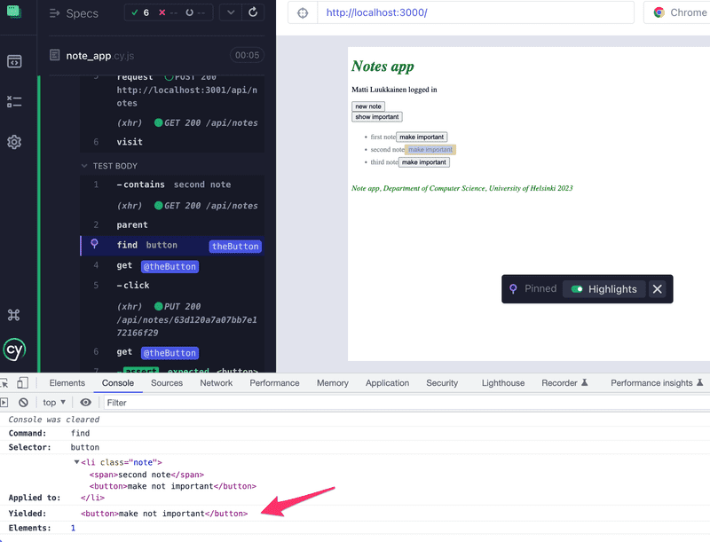

### We can run Cypress tests from the command line

We just have to add an npm script for it:

```json
  "scripts": {
    "cypress:open": "cypress open",

    "test:e2e": "cypress run"
  },
```

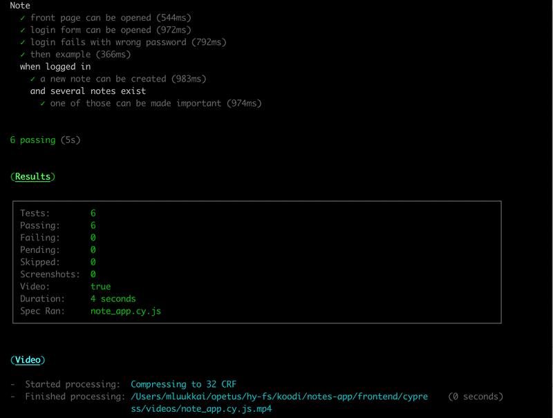

Note that videos of the test execution will be saved to `cypress/videos/`, so you should probably git ignore this directory. It is also possible to turn off the making of videos.

## Last Steps

The Full Stack Open course says that the Cypress documentation 'is probably the best documentation it has ever seen for an open-source project'. They specially recommend the [Introduction](https://docs.cypress.io/guides/core-concepts/introduction-to-cypress.html#Cypress-Can-Be-Simple-Sometimes)